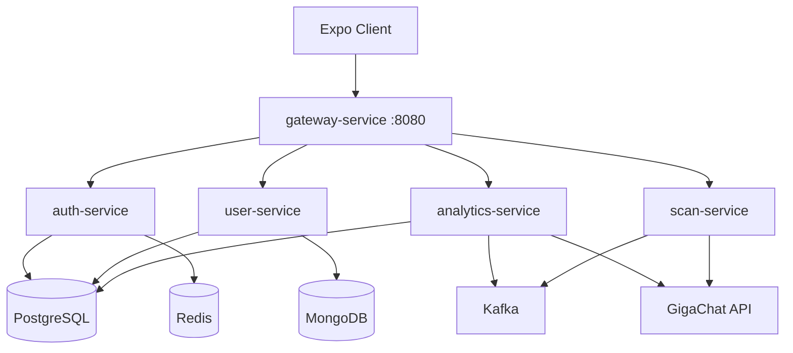

# ГЛАВА 5. ПРОГРАММНАЯ ДОКУМЕНТАЦИЯ

> Раздел для дипломной работы по программному комплексу **Product-allergen**.  
> Структура соответствует типовому оформлению: руководство пользователя, руководство администратора (эксплуатация), руководство программиста.

---

## 5. Программная документация

Программная документация описывает порядок работы с комплексом для конечного пользователя, администратора инфраструктуры и разработчика, сопровождающего систему.

---

## 5.1. Руководство пользователя

Пользователь обращается к системе через клиентское приложение **Product-allergen** (мобильное приложение на Android/iOS или веб-клиент), собранное на базе **Expo / React Native**. Все запросы к серверу направляются на единый адрес API — **gateway-service** (по умолчанию `http://<хост-сервера>:8080`). В комплексе предусмотрена одна пользовательская роль — **зарегистрированный пользователь** (лицо с пищевой аллергией или непереносимостью, ведущее дневник самоконтроля). Отдельных ролей «наставник / аспирант» или панели верификации учётных записей в пользовательском интерфейсе нет: после успешной регистрации доступ к функциям открывается сразу.

### 5.1.1. Регистрация и вход в систему

При первом запуске приложения отображается экран **«Вход»**. Для создания учётной записи выбирается ссылка **«Зарегистрироваться»**. На форме регистрации указываются:

- электронная почта;
- пароль (не короче 8 символов);
- подтверждение пароля.

После подтверждения регистрации выполняется запрос `POST /auth/register`; при успешном ответе пользователь переходит к пошаговому заполнению медицинского профиля (см. п. 5.1.2). Учётная запись сохраняется в **auth-service** (PostgreSQL); пары токенов access и refresh выдаются немедленно.

**Повторный вход** осуществляется на экране авторизации с указанием электронной почты и пароля (`POST /auth/login`). Токен доступа (access) действует ограниченное время (по умолчанию 15 минут); при истечении срока клиент автоматически обновляет сессию через `POST /auth/refresh`, используя refresh-токен из локального хранилища. Выход из системы выполняется в разделе **«Профиль»** (`POST /auth/logout` и очистка сохранённых токенов).

### 5.1.2. Заполнение и редактирование профиля

После регистрации система предлагает пройти **мастер первичной настройки** в два шага:

1. **Шаг 1** — антропометрические и общие данные: пол, возраст, вес, рост (при необходимости — ФИО на последующих экранах настройки).
2. **Шаг 2** — медицински значимые сведения: список **аллергенов** (теги из предложенного перечня или произвольный ввод), **хронические заболевания**, признаки образа жизни (курение, алкоголь, физическая активность).

Раздел **«Профиль»** доступен из нижней панели вкладок в любое время. В режиме редактирования пользователь может изменить ФИО, возраст, пол, вес, рост, город, списки аллергенов и заболеваний, предрасположенность к аллергии, переключатели образа жизни и поле **«Заметки врача»**. Данные сохраняются через `GET/PUT /api/user/info` (**user-service**).

Корректно заполненный профиль (в первую очередь список аллергенов) необходим для работы **сканера этикетки**: без него серверный анализ состава не сможет сопоставить ингредиенты с индивидуальными ограничениями пользователя.

### 5.1.3. Основное приложение: навигация

После входа пользователь попадает в основную зону приложения с **четырьмя вкладками** нижней панели:

| Вкладка | Назначение |
|---------|------------|
| **Дневник** | Ежедневный учёт питания, симптомов, самочувствия, лекарств и заметок |
| **Камера** | Съёмка и анализ состава продукта по фотографии этикетки |
| **Отчёты** | Пищевой анализатор триггеров и формирование PDF-отчётов |
| **Профиль** | Просмотр и редактирование медицинского профиля, выход |

### 5.1.4. Работа с дневником

Вкладка **«Дневник»** объединяет записи за выбранную дату. Пользователь может добавлять, изменять и удалять следующие типы данных:

**Приёмы пищи** — выбор продукта или блюда из справочника (`/api/food`), количество, дата и время приёма. Список отображается в хронологическом порядке. API: `GET/POST/PUT/DELETE /api/feelings/food`.

**Симптомы** — выбор симптома из справочника (`/api/symptoms`), указание тяжести и интервала начала/окончания. API: `GET/POST/PUT/DELETE /api/feelings/symptoms`, просмотр за период — `GET /api/feelings/symptoms/range`.

**Самочувствие** — числовая оценка состояния за день (шкала), с возможностью просмотра динамики. API: `GET/POST/PUT/DELETE /api/feelings/common`.

**Лекарства** — ведение справочника препаратов (`/api/medicines`) и журнала приёма с датой и дозировкой (`/api/feelings/medicines`).

**Заметки** — произвольные текстовые записи, привязанные к дате (`/api/feelings/notes`).

Для быстрого добавления записи используются отдельные экраны (например, «Добавить приём пищи», «Добавить симптом»), вызываемые из дневника.

Типовой ежедневный сценарий: зафиксировать приёмы пищи и самочувствие; при появлении реакции — добавить симптом с указанием времени.

### 5.1.5. Раздел «Отчёты»

Вкладка **«Отчёты»** содержит два взаимосвязанных блока.

**Пищевой анализатор (триггеры)** — пользователь задаёт период «с» — «по» и запрашивает сопоставление продуктов из дневника со связанными симптомами (`GET /api/food-analyzer/analyze?from=&to=`). Результат отображается в виде таблицы или списка: продукт (компонент) и перечень симптомов, зафиксированных в том же интервале. При отсутствии данных за период выводится подсказка о необходимости заполнить дневник.

**Медицинский отчёт (PDF)** — выбор типа отчёта (краткий, подробный, анализ продуктов, анализ симптомов), периода и кнопка **«Сформировать отчёт»**. Запрос уходит на `GET /reports/generate` (**analytics-service**); при успехе клиент сохраняет или открывает PDF-файл средствами операционной системы (общий доступ, просмотр). Формирование отчёта может занять до нескольких минут: на сервере выполняется сбор данных из **user-service**, построение шаблона **JasperReports** и при включённой интеграции — обогащение текстовым блоком от **GigaChat**. Список ранее сформированных отчётов доступен на том же экране (статусы: «Готов», «Обрабатывается», «Ошибка»).

Сценарий визита к врачу: выбрать период наблюдения → сформировать подробный PDF → передать файл специалисту.

### 5.1.6. Сканер этикетки (вкладка «Камера»)

Раздел реализует сценарий **scan-service**: фотография блока «Состав» на упаковке → распознавание и анализ ингредиентов с учётом профиля пользователя.

Порядок действий:

1. Предоставить приложению доступ к камере (при первом использовании).
2. Навести камеру на этикетку (рекомендуется хорошее освещение, ровное удержание, попадание блока «Состав» в кадр).
3. Выполнить съёмку; приложение автоматически отправляет изображение на `POST /scans/analyze` (поле `image`, формат `multipart/form-data`, таймаут до 180 с).
4. На экране результата отображаются:
   - числовая **оценка риска** (0–100) и цветовой уровень (**низкий / средний / высокий**);
   - списки ингредиентов по категориям (безопасно, с осторожностью, не рекомендуется);
   - текстовая **рекомендация** для пользователя (в т. ч. поле, предназначенное для передачи врачу).

Цветовая индикация дублируется текстовыми подписями для доступности. При ошибке сети или сервиса GigaChat пользователю показывается понятное сообщение с предложением повторить съёмку.

На веб-сборке допускается локальный анализ без сервера (OCR в браузере); в мобильной сборке основной режим — **серверный** анализ через **GigaChat Vision**.

---

## 5.2. Руководство администратора

В комплексе **Product-allergen** нет отдельной роли «администратор пользователей» с веб-панелью верификации учётных записей (в отличие от учебных систем наставничества). Под администратором понимается **администратор инфраструктуры** — лицо, разворачивающее и сопровождающее серверную часть и внешние интеграции.

### 5.2.1. Состав развёртывания

Программный комплекс эксплуатируется в контейнерной среде **Docker** (рекомендуется оркестрация через **docker compose** на выделенном сервере или **Portainer**). Минимальный состав:

| Компонент | Назначение |
|-----------|------------|
| **gateway-service** | Единая точка входа, порт **8080** |
| **auth-service** | Регистрация, JWT, refresh в Redis |
| **user-service** | Дневник, профиль, пищевой анализатор |
| **analytics-service** | PDF-отчёты, снимки отчётов, Kafka/GigaChat |
| **scan-service** | Анализ этикетки по фото |
| **PostgreSQL** | Учётные записи (auth), отчёты (analytics), опционально сканы |
| **MongoDB** | Дневник и расширенный профиль (user) |
| **Redis** | Хранение refresh-токенов |
| **Apache Kafka** | Опционально: асинхронное AI-обогащение отчётов и сканов |
| Внешний API **GigaChat** | LLM и vision-анализ |

Клиентское приложение (**Product-allergen-frontend**) разворачивается отдельно: сборка **Expo** (`npx expo start` для разработки, EAS Build для мобильных релизов). В `app.config` / переменной **`EXPO_PUBLIC_API_URL`** задаётся базовый URL gateway (не внутренние порты микросервисов).

### 5.2.2. Обязательные параметры окружения

Секреты и адреса БД **не следует** хранить в репозитории; они передаются через `docker-compose.yml` или секреты Portainer.

| Переменная | Назначение |
|------------|------------|
| `JWT_SECRET` | Подпись access/refresh (единое значение для gateway и auth) |
| `INTERNAL_SECRET` / `INTERNAL_API_SECRET` | Заголовок `X-Internal-Gateway-Token` между gateway и сервисами |
| `JWT_ACCESS_EXPIRATION` | Срок access-токена (мс), по умолчанию 900000 (15 мин) |
| `JWT_REFRESH_EXPIRATION` | Срок refresh-токена (мс), по умолчанию 7 суток |
| `SPRING_DATASOURCE_*` | Подключение к PostgreSQL (отдельно для auth, user, analytics, scan) |
| `SPRING_DATA_MONGODB_URI` | Подключение user-service к MongoDB |
| `GIGACHAT_AUTH_KEY` | Ключ API GigaChat (analytics и scan) |
| `GIGACHAT_MODEL` | Модель, например `GigaChat-2-Max` |
| `KAFKA_BOOTSTRAP_SERVERS` | Адрес брокера, если Kafka включена |
| `SCAN_KAFKA_ENABLED` | `false` — прямой вызов GigaChat (рекомендуется для крупных изображений) |
| `SCAN_PERSISTENCE_ENABLED` | `false` — история сканов в памяти до перезапуска; `true` — PostgreSQL |

После изменения секретов необходимо перезапустить затронутые контейнеры в согласованном порядке: инфраструктура БД → микросервисы → gateway.

### 5.2.3. Запуск и контроль работоспособности

1. Поднять контейнеры БД, Redis, Kafka (при использовании).
2. Запустить **auth-service**, **user-service**, **analytics-service**, **scan-service**.
3. Запустить **gateway-service** и убедиться, что порт 8080 доступен с клиентских устройств.
4. Проверить маршруты: `POST /auth/login`, `GET /api/user/info` (с валидным JWT), `GET /reports/...`, `POST /scans/analyze` (с тестовым изображением).

Для диагностики без клиента на каждом сервисе доступен **Swagger UI** (`/swagger-ui.html`). В логах **analytics-service** и **scan-service** используются префиксы **[ReportAI]** и **[ScanAI]** для отслеживания цепочки GigaChat/Kafka.

### 5.2.4. Резервное копирование и ограничения прототипа

Рекомендуется регулярное резервное копирование томов **PostgreSQL** и **MongoDB**. При `SCAN_PERSISTENCE_ENABLED=false` история сканов не переживает перезапуск **scan-service**. Качество AI-ответов зависит от доступности GigaChat и выбранной модели; при исчерпании квоты API пользователи увидят ошибки на экранах «Отчёты» и «Камера».

---

## 5.3. Руководство программиста

В данном разделе описаны архитектура, используемые технологии и конфигурация. Документация предназначена разработчику, сопровождающему программный комплекс **Product-allergen**.

### 5.3.1. Архитектура и стек технологий

Система реализует **микросервисную клиент-серверную архитектуру** с единым API-шлюзом.

**Уровень представления** — кроссплатформенное приложение на **React Native** с фреймворком **Expo** (TypeScript), навигация **Expo Router** (`app/(tabs)/`). Сборка и отладка — **Vite** не используется (в отличие от SPA на React); для web применяется сборка Expo.

**Уровень бизнес-логики** — пять Java-приложений на **Spring Boot 3.3.x** (**Java 17**):

- **gateway** — Spring Cloud Gateway, маршрутизация, JWT-фильтр, CORS;
- **auth-service** — Spring Web, Spring Data JPA, Spring Security, **jjwt**, Redis для refresh;
- **user-service** — REST API дневника, JPA (PostgreSQL) + **MongoDB** для документов дневника, модуль **foodanalyzer**;
- **analytics-service** — JasperReports (PDF), Feign к user-service, Kafka, интеграция **GigaChat**;
- **scan-service** — приём `multipart`, GigaChat Vision, опционально Kafka и JPA.

**Уровень данных:**

- **PostgreSQL** — учётные записи, метаданные отчётов и снимков, опционально история сканов;
- **MongoDB** — записи дневника и профиль в user-service;
- **Redis** — refresh-токены auth-service;
- **Apache Kafka** — асинхронный обмен задачами AI (отчёты; сканы — опционально).

**Внешние сервисы:** API **GigaChat** (текстовый анализ отчётов и vision для этикеток).

**Развёртывание:** Docker, для каждого репозитория — собственный `docker-compose.yml`; клиент подключается только к **gateway:8080**.

Схема взаимодействия:

### 5.3.2. Структура backend-модулей и репозиториев

Серверная часть разнесена по **пяти репозиториям** (каждый — отдельный Maven-проект). Базовый пакет: `ru.productallergen.*`.

| Репозиторий / сервис | Бизнес-область | Основные пакеты / модули |
|----------------------|----------------|---------------------------|
| **Product-allergen-gateway** | Маршрутизация, JWT, внутренний токен | `ru.productallergen.gateway.filter`, маршруты `/auth/**`, `/api/**`, `/reports/**`, `/scans/**` |
| **Product-allergen-auth** | Регистрация, вход, refresh, logout | `ru.productallergen.auth` — контроллеры `/auth/*`, сущности пользователя, JWT |
| **Product-allergen-user** | Профиль, дневник, справочники, анализатор пищи | `userInfo` (feelings, notes, medicines), `foodanalyzer`, справочники `Food`, `Symptom`, `Medicine` |
| **Product-allergen-new** (analytics-service) | PDF-отчёты, снимки JSONB, AI | `report`, `kafka`, `service.GigaChatAnalysisService`, Jasper-шаблон `medical_report.jrxml` |
| **Product-allergen** (scan-service) | Анализ этикетки | `scan` — контроллер `/scans/analyze`, GigaChat Vision, in-memory или JPA store |

**Клиент** (**Product-allergen-frontend**):

| Модуль | Файлы | Префикс API |
|--------|-------|-------------|
| Аутентификация | `src/api/authApi.ts` | `/auth/*` |
| Дневник | `src/api/diaryApi.ts` | `/api/*` |
| Профиль | `src/api/profileApi.ts` | `/api/user/info` |
| Отчёты | `src/api/reportApi.ts` | `/reports/*` |
| Сканер | `src/api/scanApi.ts` | `/scans/*` |

Базовый URL: `src/api/config.ts` (`API_BASE_URL`, переменная `EXPO_PUBLIC_API_URL`).

**Безопасность периметра:** клиент передаёт `Authorization: Bearer <access>`. Gateway проверяет JWT и для защищённых маршрутов добавляет заголовки **`X-User-Id`** и **`X-Internal-Gateway-Token`** при проксировании в user, analytics и scan. Прямые вызовы микросервисов в обход gateway в продуктивной среде не предусмотрены.

### 5.3.3. Конфигурация

Основной конфигурационный файл каждого сервиса — **`src/main/resources/application.yml`**. Параметры, которые нежелательно хранить в репозитории, задаются **переменными окружения** в `docker-compose.yml`.

**gateway** (`Product-allergen-gateway/gateway`):

- `server.port: 8080`;
- маршруты `spring.cloud.gateway.routes` на `auth-service`, `user-service`, `analytics-service`, `scan-service`;
- `jwt.secret`, `jwt.claim.id`;
- `internal.api.secret` → заголовок внутреннего доверия.

**auth-service**:

- `jwt.access.expiration` — `${JWT_ACCESS_EXPIRATION:900000}`;
- `jwt.refresh.expiration` — `${JWT_REFRESH_EXPIRATION:604800000}`;
- `spring.datasource.*`, `spring.data.redis.*`.

**user-service**:

- PostgreSQL + `spring.data.mongodb.connection-string`;
- `internal.api.secret`.

**analytics-service**:

- `report.template-path`, топики Kafka `report-ai-requests` / `report-ai-results`;
- `gigachat.auth-key`, `gigachat.model`;
- `app.security.internal-header`, `app.security.user-id-header`.

**scan-service**:

- `spring.servlet.multipart.max-file-size: 10MB`;
- `scan.persistence.enabled`, `scan.kafka.enabled`;
- `gigachat.*` — аналогично analytics.

**Сборка и тесты:** в каждом сервисе — `mvn test` (JUnit 5, MockMvc). Совокупно backend содержит порядка **128** автоматизированных тестов (auth, gateway, user, analytics, scan). Клиентские UI-тесты в текущей версии не автоматизированы.

**Локальная разработка:** поднять инфраструктуру compose, запустить сервисы с профилем dev, в Expo указать `EXPO_PUBLIC_API_URL=http://<IP-хоста>:8080` (для эмулятора Android — IP машины разработчика, не `localhost` контейнера).

---

## 5.4. Выводы по главе программной документации

В главе 5 систематизированы инструкции для трёх категорий читателей. **Пользователь** работает через мобильное или веб-приложение с четырьмя основными разделами (дневник, камера, отчёты, профиль) и не взаимодействует с микросервисами напрямую. **Администратор инфраструктуры** разворачивает Docker-контейнеры, настраивает секреты JWT, внутренний токен gateway и ключ GigaChat, контролирует доступность порта 8080 и резервное копирование БД. **Программист** опирается на описанную микросервисную декомпозицию, единый шлюз, контракты REST и файлы `application.yml` при сопровождении и расширении комплекса.

Документация согласована с реализацией главы 3 и результатами тестирования главы 4: описанные сценарии соответствуют фактическому поведению репозиториев **Product-allergen-frontend** и серверных модулей на момент завершения дипломной работы.

---

## Сводная таблица рисунков (рекомендуемая)

| Рисунок | Содержание |
|---------|------------|
| 5.1 | Экран входа и регистрации |
| 5.2 | Мастер настройки профиля (шаги 1–2) |
| 5.3 | Вкладка «Дневник» с секциями записей |
| 5.4 | Вкладка «Отчёты»: анализатор и PDF |
| 5.5 | Вкладка «Камера»: результат сканирования |
| 5.6 | Схема развёртывания Docker (из главы 3) |
| 5.7 | Архитектура взаимодействия клиент — gateway — микросервисы |

*Скриншоты интерфейса можно снять с эмулятора или веб-сборки Expo; диаграммы — экспорт из `docs/uml` соответствующих репозиториев.*
