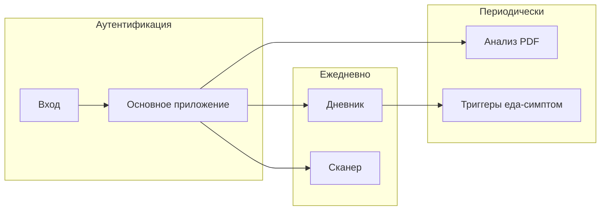

# Структура пользовательского интерфейса программного комплекса Product-allergen

> Раздел для главы «Реализация пользовательского интерфейса» (диплом).  
> **ВСТАВИТЬ РИСУНОК** — `docs/uml/plantuml/ui/01-ui-navigation-structure.puml`  
> *Подпись:* «Рисунок X — Структура навигации клиентского приложения».

---

## 1. Общие принципы построения интерфейса

Клиентское приложение (мобильное на Android/iOS или web-клиент) является **презентационным уровнем** программного комплекса. Оно не содержит бизнес-логики хранения медицинских данных: вся обработка выполняется на сервере, а интерфейс обеспечивает ввод, отображение и навигацию.

**Архитектурные решения интерфейса:**

| Принцип | Реализация |
|---------|------------|
| Единая точка входа | Все HTTP-запросы на `gateway-service` (порт 8080) |
| Формат обмена | JSON; для сканера — `multipart/form-data` (изображение) |
| Аутентификация | JWT access в заголовке `Authorization: Bearer …` |
| Идентификация сессии | Пара access + refresh; при 401 — `/auth/refresh` |
| Разделение зон | Неавторизованная (вход/регистрация) и основное приложение |
| Доступность | Крупные зоны нажатия, контраст для статусов scan (цвет + текст) |

Логическая связь экранов с микросервисами: **auth-service** (учётная запись), **user-service** (дневник и профиль), **analytics-service** (отчёты), **scan-service** (анализ этикетки через GigaChat).

---

## 2. Иерархия и навигация

Интерфейс организован по модели **нижней панели вкладок (Tab Bar)** с пятью разделами. Такое разделение соответствует частоте использования: ежедневный дневник — центральная функция; анализ и сканер — периодические сценарии.

```
┌─────────────────────────────────────────────────────────┐
│  [Главная] [Дневник] [Анализ] [Сканер] [Профиль]       │
└─────────────────────────────────────────────────────────┘
```

**Неавторизованная зона** (до первого успешного входа):

1. Экран входа  
2. Экран регистрации  
3. (опционально) восстановление доступа через повторный login после истечения refresh  

После `POST /auth/login` или `/auth/register` приложение сохраняет токены и переходит в **основную зону**.

**ВСТАВИТЬ РИСУНОК** — схема навигации (`ui/01-ui-navigation-structure.puml`).

---

## 3. Структура экранов по функциональным модулям

### 3.1. Модуль аутентификации

| Экран | Назначение | Элементы интерфейса | API |
|-------|------------|---------------------|-----|
| Вход | Авторизация | Поля email, пароль; кнопки «Войти», «Регистрация»; индикатор загрузки | `POST /auth/login` |
| Регистрация | Создание учётной записи | Email, пароль, подтверждение пароля; валидация (≥8 символов) | `POST /auth/register` |
| Выход | Завершение сессии | Пункт в меню профиля | `POST /auth/logout` + очистка local storage |

При успешном ответе сохраняются `accessToken` и `refreshToken`. Access используется для всех защищённых запросов; срок жизни — 15 минут (конфигурация auth-service).

---

### 3.2. Модуль «Главная» (дашборд)

| Экран | Назначение | Элементы интерфейса | API / данные |
|-------|------------|---------------------|--------------|
| Главная | Обзор за сегодня | Карточки: последний приём пищи, самочувствие, краткое напоминание о профиле; быстрые действия «Добавить приём», «Сканировать этикетку» | Агрегация из `GET /api/feelings/food`, `GET /api/feelings/common` за текущую дату |

Дашборд сокращает путь к частым операциям и не дублирует полные формы дневника.

---

### 3.3. Модуль «Дневник»

Подраздел с **внутренней навигацией** (вкладки или сегментированный control):

#### 3.3.1. Приёмы пищи

| Элемент | Описание |
|---------|----------|
| Список за дату | Хронология записей с временем, названием продукта/блюда |
| Форма добавления | Выбор продукта из справочника (`/api/food`), количество, дата/время |
| Редактирование / удаление | Swipe-действия или контекстное меню |

API: `GET/POST/PUT/DELETE /api/feelings/food`.

#### 3.3.2. Симптомы

| Элемент | Описание |
|---------|----------|
| Список симптомов за период | Связь с справочником `/api/symptoms` |
| Форма записи | Симптом, тяжесть, интервал начала/окончания |

API: `GET/POST /api/feelings/symptoms`, `GET /api/feelings/symptoms/range`.

#### 3.3.3. Самочувствие

| Элемент | Описание |
|---------|----------|
| Шкала за день | Числовая или визуальная шкала (например 1–10) |
| Календарь/график | Просмотр динамики за неделю |

API: `GET/POST /api/feelings/common`.

#### 3.3.4. Лекарства

| Элемент | Описание |
|---------|----------|
| Справочник препаратов | CRUD `/api/medicines` |
| Журнал приёма | Дата, доза, единица — `/api/feelings/medicines` |

#### 3.3.5. Заметки

| Элемент | Описание |
|---------|----------|
| Текстовые заметки | Свободный ввод, привязка к дате |

API: `GET/POST /api/feelings/notes`.

---

### 3.4. Модуль «Профиль»

| Экран | Элементы | Поля данных (UserInfoWebDto) | API |
|-------|----------|------------------------------|-----|
| Медицинский профиль | ФИО, возраст, пол, вес, рост, город | fullName, age, gender, weight, height, country | `GET/PUT /api/user/info` |
| Аллергены и заболевания | Мультивыбор списков, теги | allergies[], chronicDiseases[] | то же |
| Предрасположенность | Переключатель / enum | predisposition | то же |
| Образ жизни | Переключатели | smoker, alcohol, sports | то же |
| Заметки врача | Многострочное поле | doctorNotes | то же |

Профиль обязателен для корректной работы **scan-service** и интерпретации анализа: без списка аллергенов классификация компонентов будет неполной.

---

### 3.5. Модуль «Анализ»

#### 3.5.1. Пищевой анализатор (триггеры)

| Элемент | Описание |
|---------|----------|
| Выбор периода | DatePicker: «с» — «по» |
| Таблица/список результатов | Компонент продукта → список связанных симптомов |
| Пустое состояние | Подсказка: «Добавьте приёмы пищи и симптомы за период» |

API: `GET /api/food-analyzer/analyze?from=&to=`.

#### 3.5.2. Медицинский отчёт (PDF)

| Элемент | Описание |
|---------|----------|
| Выбор периода | Те же даты, что для анализа |
| Кнопка «Сформировать отчёт» | Индикатор загрузки (Jasper на сервере) |
| Просмотр PDF | Встроенный viewer или скачивание файла |

API: `GET /reports/generate?from=&to=` → `application/pdf`.

---

### 3.6. Модуль «Сканер» (анализ этикетки)

Реализует сценарий **scan-service**: фото состава → GigaChat Vision → сопоставление с профилем.

| Шаг | Экран | Элементы | API |
|-----|-------|----------|-----|
| 1 | Камера / галерея | Превью кадра, кнопка «Анализировать» | — |
| 2 | Загрузка | Progress indicator, текст «Распознаём состав…» | `POST /scan/analyze` (multipart) |
| 3 | Результат | Три секции списков | JSON `ComponentAnalysisResponse` |

**Визуальная структура экрана результата:**

| Секция | Цвет (рекомендация) | Содержимое |
|--------|----------------------|------------|
| Безопасно | Зелёный `#4CAF50` | Список `safe[]`: name, reason |
| С осторожностью | Оранжевый `#FF9800` | Список `caution[]` |
| Не рекомендуется | Красный `#F44336` | Список `unsafe[]` |
| Итог | Нейтральный блок | Поле `summary` — краткое заключение |

Дополнительно: иконка статуса, доступность для пользователей с нарушением цветовосприятия (дублирование цвета текстовой меткой «Безопасно» / «Опасно»).

**ВСТАВИТЬ РИСУНОК** — макет экрана результата сканирования (wireframe или скриншот).

---

## 4. Сводная таблица «экран — сервис — endpoint»

| № | Экран / подэкран | Микросервис | Основной endpoint |
|---|------------------|-------------|-------------------|
| 1 | Вход | auth | POST `/auth/login` |
| 2 | Регистрация | auth | POST `/auth/register` |
| 3 | Главная | user | несколько GET `/api/feelings/*` |
| 4 | Приёмы пищи | user | `/api/feelings/food` |
| 5 | Симптомы | user | `/api/feelings/symptoms` |
| 6 | Самочувствие | user | `/api/feelings/common` |
| 7 | Лекарства | user | `/api/medicines`, `/api/feelings/medicines` |
| 8 | Заметки | user | `/api/feelings/notes` |
| 9 | Профиль | user | `/api/user/info` |
| 10 | Анализ триггеров | user | `/api/food-analyzer/analyze` |
| 11 | Медотчёт PDF | analytics | `/reports/generate` |
| 12 | Сканер (фото) | scan | POST `/scan/analyze` |
| 13 | Результат сканера | scan | ответ того же запроса |

---

## 5. Потоки пользователя (основные сценарии)

**Сценарий A — первичная настройка:** регистрация → заполнение профиля (аллергены) → первый приём пищи.

**Сценарий B — ежедневный мониторинг:** главная → дневник (пища + самочувствие) → при появлении симптомов — вкладка «Симптомы».

**Сценарий C — проверка продукта в магазине:** сканер → фото этикетки → экран safe/caution/unsafe → решение о покупке.

**Сценарий D — визит к врачу:** анализ → выбор периода → формирование PDF → экспорт/отправка файла.



---

## 6. Хранение данных на клиенте

| Данные | Механизм | Назначение |
|--------|----------|------------|
| accessToken, refreshToken | Secure Storage / Keychain | Сессия |
| Кэш профиля | Local DB или in-memory | Быстрый показ вкладки «Профиль» |
| Черновики форм | Optional local | Восстановление при обрыве сети |
| PDF отчёт | Файловая система приложения | Повторный просмотр без запроса |

Токены **не** передаются в scan-service и user-service напрямую — только через gateway.

---

## 7. Требования к адаптивности и UX

- **Мобильный приоритет:** основные сценарии (дневник, камера) ориентированы на смартфон.  
- **Web:** та же структура вкладок, формы — responsive layout (breakpoints для планшета/десктопа).  
- **Обратная связь:** toast/snackbar при ошибках API (409 email занят, 401 сессия истекла).  
- **Офлайн:** просмотр последних закэшированных записей дневника; отправка — при появлении сети (очередь — опциональное улучшение).  
- **Локализация:** интерфейс на русском языке в соответствии с предметной областью диплома.

---

## 8. Связь с реализацией backend

Структура интерфейса **однозначно сопоставлена** с REST API реализованных микросервисов. Изменение контракта (например, полей `ComponentAnalysisResponse` в scan-service) требует синхронного обновления моделей представления (ViewModel / DTO) на клиенте.

Для разработки клиента целесообразно использовать:

- общий модуль HTTP-клиента с interceptor для Bearer и refresh;
- отдельные feature-модули: `auth`, `diary`, `profile`, `analytics`, `scan`;
- единый `NavHost` / router, соответствующий дереву на рисунке структуры навигации.

---

## 9. Вывод по разделу

Структура пользовательского интерфейса построена модульно и отражает микросервисную архитектуру backend: пять вкладок покрывают учётную запись, ежедневный дневник, аналитику, экспресс-проверку продуктов и медицинский профиль. Навигация разделена на неавторизованную и основную зоны; каждый экран привязан к конкретным REST endpoint через API Gateway. Такое проектирование обеспечивает расширяемость (добавление новых вкладок без изменения существующих сервисов) и соответствует требованиям диплома по описанию реализации пользовательского интерфейса.

---

*Конец документа.*
